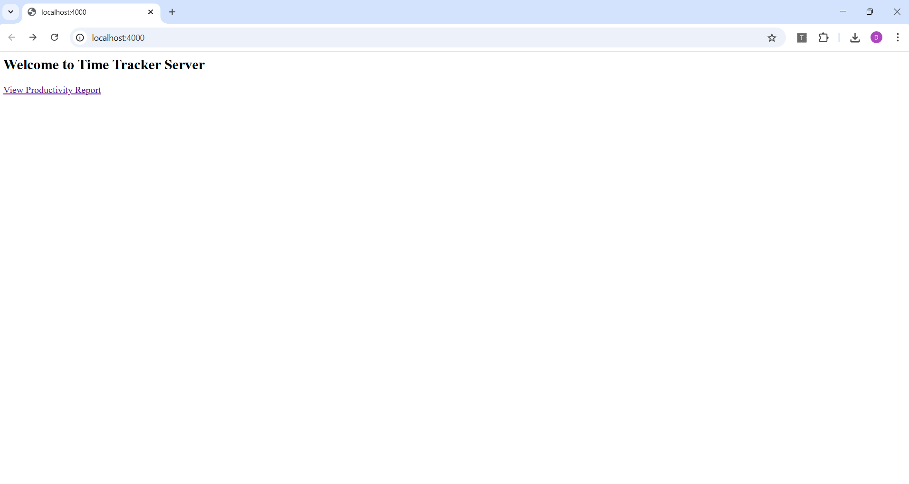
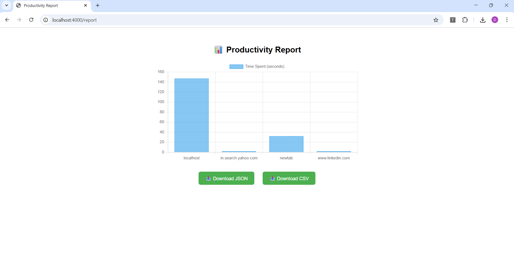

# ⏱️ Chrome Extension: Time Tracker & Productivity Analytics

This project is a Chrome Extension that tracks the time you spend on websites and classifies them as productive or unproductive. It visualizes weekly productivity trends and syncs data to a backend server.

## 🔧 Tech Stack
- JavaScript (ES6+)
- HTML/CSS
- Chrome Extension APIs
- Chart.js
- Node.js + Express
- EJS (for report view)


## 📁 Project Structure

├── time-tracker-extension/ # Chrome Extension
├── backend/ # Node.js backend
└── README.md

## 🚀 Features

- Automatically tracks active website time
- Classifies websites as productive or unproductive
- Real-time chart in the extension popup (Chart.js)
- Sync data with backend (`/track`)
- View detailed report at `http://localhost:4000/report`
- Download reports in JSON or CSV
- Reset all stored data with one click

---

## 🧪 How to Run

### 1. Load Chrome Extension
- Open `chrome://extensions`
- Enable "Developer Mode"
- Click "Load Unpacked"
- Select the `time-tracker-extension` folder

### 2. Start Backend
```bash
cd backend
npm install
node index.js
Visit http://localhost:4000/report

SAMPLE SCREENSHOT



